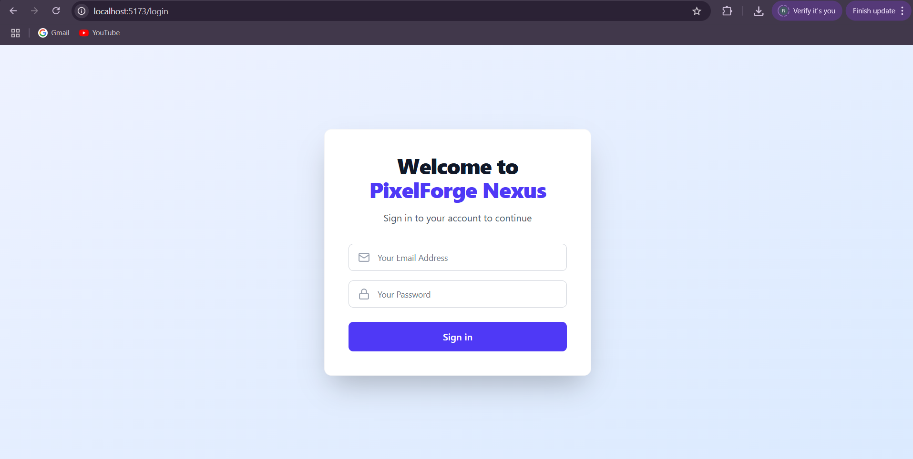
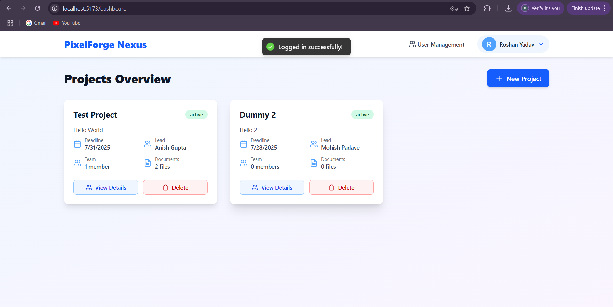
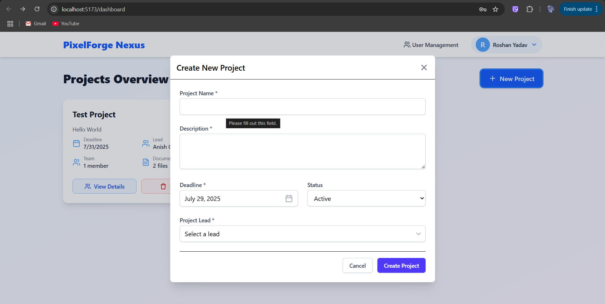
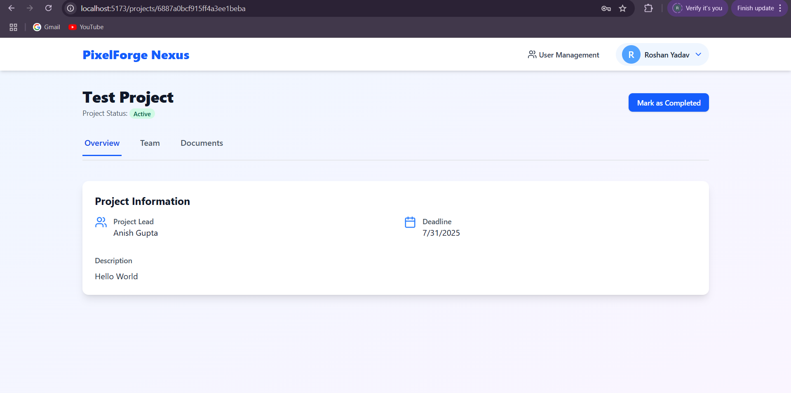
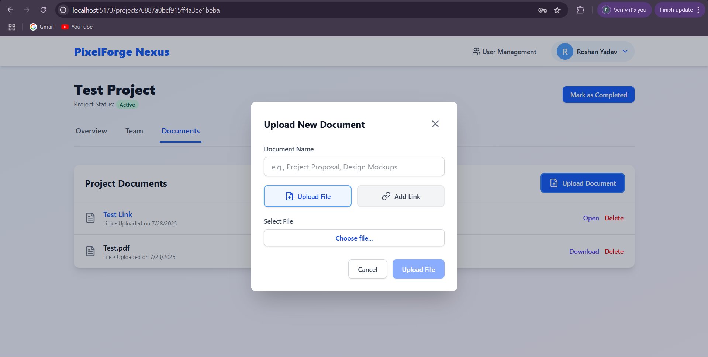
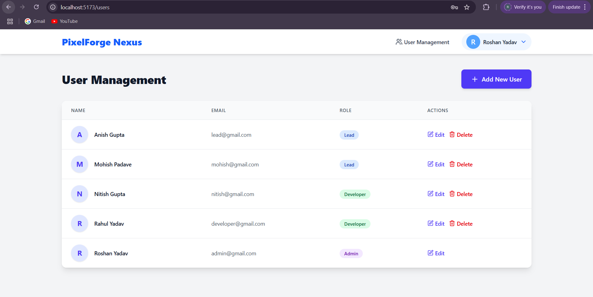
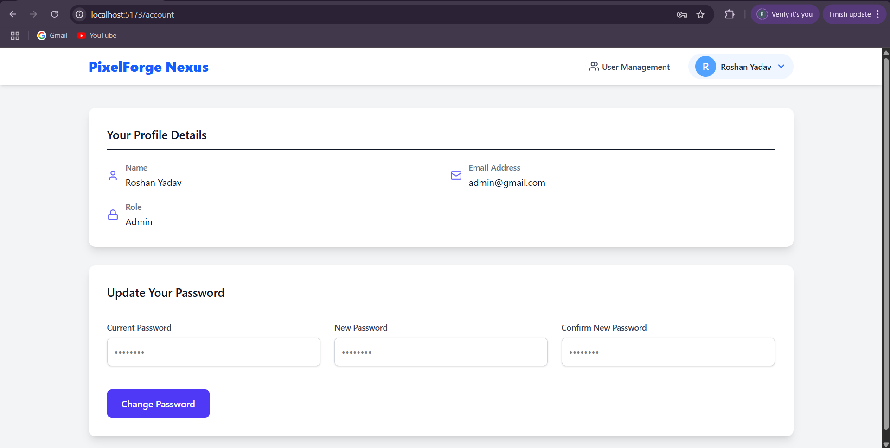

# PixelForge Nexus - Secure Project Management System

## Overview

"PixelForge Nexus" is a secure, role-based project management platform designed for creative teams, particularly within the game development industry. It streamlines project, team, and digital asset management, emphasizing robust security and granular access control. This system showcases a "secure-by-design" approach, integrating authentication, authorization, and secure data handling from its foundational architecture.


## Features

  * **User Authentication:** Secure login for all users.
  * **Role-Based Access Control (RBAC):** Distinct privileges for `Admin`, `Project Lead`, and `Developer` roles.
  * **User Management (Admin):** Admins can create, view, update, and delete user accounts.
  * **Project Management:**
      * Create, view, update, and delete projects.
      * Assign Project Leads and team members.
      * Track project status (e.g., Active, Completed).
      * Role-based project visibility.
  * **Document Management:**
      * Upload binary files (e.g., design docs, assets) linked to specific projects.
      * Upload external document links (e.g., Google Drive, Figma links).
      * View and download project-specific documents.
      * Secure document deletion.
  * **Profile Management:** Users can update their own passwords.

## Technical Stack

  * **Frontend:**
      * **React.js:** A JavaScript library for building user interfaces.
      * **Tailwind CSS:** A utility-first CSS framework for rapid UI development.
      * **Zustand:** A small, fast, and scalable state-management solution for React.
      * **Axios:** Promise-based HTTP client for making API requests.
      * **React Router DOM:** For declarative routing in the React application.
      * **react-hot-toast:** For simple, accessible, and customizable notifications.
      * **Lucide React:** A collection of beautiful, community-driven icons.
  * **Backend:**
      * **Node.js:** JavaScript runtime environment.
      * **Express.js:** Fast, unopinionated, minimalist web framework for Node.js.
      * **Mongoose:** MongoDB object data modeling (ODM) for Node.js.
      * **bcryptjs:** Library for hashing passwords.
      * **jsonwebtoken:** For implementing JWTs.
      * **multer:** Node.js middleware for handling `multipart/form-data`, primarily used for file uploads.
      * **cors:** Node.js middleware for enabling Cross-Origin Resource Sharing.
      * **dotenv:** Loads environment variables from a `.env` file.

## Setup & Run Locally

To get a local copy up and running, follow these steps.


### Installation Steps

1.  **Clone the Repository:**

    ```bash
    git clone https://github.com/Roshan-504/PixelForge-Nexus-Secure-Project-Management.git
    cd PixelForge-Nexus-Secure-Project-Management
    ```

2.  **Backend Setup:**

    Navigate into the `backend` directory:

    ```bash
    cd backend
    ```

      * Install backend dependencies:
        ```bash
        npm install
        ```
      * Create a `.env` file in the `backend` directory and add your environment variables:
        ```env
        PORT=5000
        MONGO_URI="mongodb+srv://[YOUR_MONGO_USERNAME]:[YOUR_MONGO_PASSWORD]@[YOUR_CLUSTER_URL]/[YOUR_DATABASE_NAME]?retryWrites=true&w=majority"
        JWT_SECRET="[A_VERY_STRONG_RANDOM_STRING_FOR_JWT_SECRET]"
        FRONTEND_URL="http://localhost:3000"
        ```
      * Start the backend server:
        ```bash
        npm run dev
        ```
        The backend will run on `http://localhost:3000` .

3.  **Frontend Setup:**

    Open a **new terminal window** and navigate into the `frontend` directory:

    ```bash
    cd ../frontend # If you're currently in the server folder
    # Or, if from the project root: cd frontend
    ```

      * Install frontend dependencies:
        ```bash
        npm install
        ```
      * Start the frontend development server:
        ```bash
        npm run dev
        ```
        The frontend application will open in your browser, at `http://localhost:5173`.

## 🔐 Login Credentials

Use the following credentials to explore the system's functionalities and role-based access control. All passwords are set to role name for ease of testing (e.g., admin, lead, developer).

**🛠️ Admin Account**
    **Email:** admin@gmail.com
    **Password:** admin
 **After logging in as an Admin, you can create new users by assigning a role, name, and email.**
 **The default password will be the role name (e.g., admin, lead, developer).**
 **Users can later update their password.**


## 📸 Screenshots

### 🔐 Login Page


### 🛠 Admin Dashboard


### 📁 Project Creation


### 📁 Project Details


### 📤 Document Upload


### 👥 User Management


### 👥 Account Settings



## Usage & Demonstrations

Once the application is running, navigate to `http://localhost:5173`.

  * Log in with the provided test credentials to explore different functionalities:
      * **Admin:** Access user management, create/delete projects, update project status, manage all documents.
      * **Project Lead:** View projects they lead or are assigned to, manage team members on their projects, upload/delete documents.
      * **Developer:** View assigned projects, download/view associated documents.
  * Observe the enforcement of **Role-Based Access Control** when attempting unauthorized actions (e.g., a Developer trying to access Admin-only features).
  * Test the document upload and download features.
